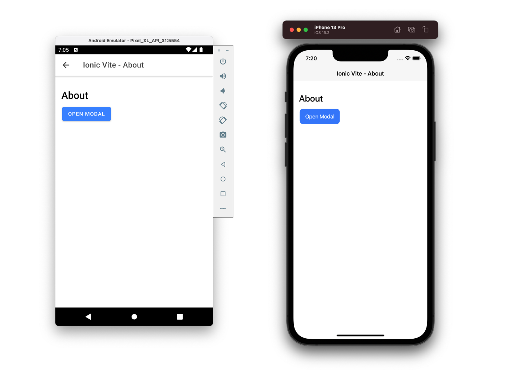

# Getting Started with ViteJS, Ionic Framework v6, VueJS and Capacitor

$ npm config set python /usr/bin/python3
$ sudo gem install activesupport -v 6.1.7.3
$ sudo gem install cocoapods
$ npm i -g @ionic/cli
$ sudo rm -rf /Library/Developer/CommandLineTools
$ xcode-select --install
$ sudo xcode-select -s /Applications/Xcode.app/Contents/Developer

[ionic docs](https://ionicframework.com/docs/components)

## Recommended IDE Setup

[VSCode](https://code.visualstudio.com/) + [Vue Language Features (Volar)
](https://marketplace.visualstudio.com/items?itemName=vue.volar)

